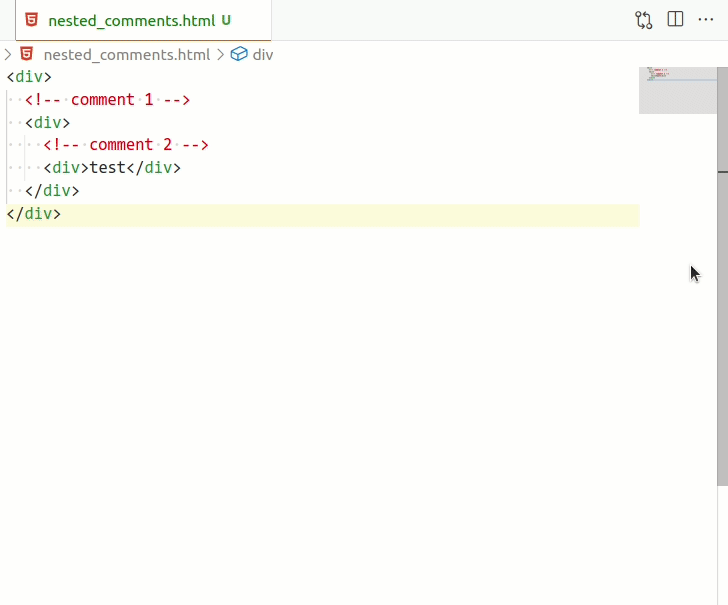

# vscode-toggle-nested-html-comments README

Like `Toggle Line Comment`, but preserves nested HTML comments.

## Features

- The default `Toggle Line Comment` command will not handle nested HTML comments, trying to outcomment a block of HTML that contains comments itself will result in broken HTML.
- This extensions offers the `Toggle nested HTML Comments` command that will help preserve nested HTML comments by rewriting them first.

This animation explains it best:

## Configuration

- By default the HTML comments are disabled like `<!--` becoming `<!-#-` and `-->` becoming `-#->`.
- You can change that by defining different replacements in `disabledHtmlCommentStart` and `disabledHtmlCommentEnd`.

## Known Issues

- I'm using the `Emmet: Balance (outward)` to get a good starting selection, there's probably some edge cases with selections I am currently not handling properly.

**Enjoy!**
